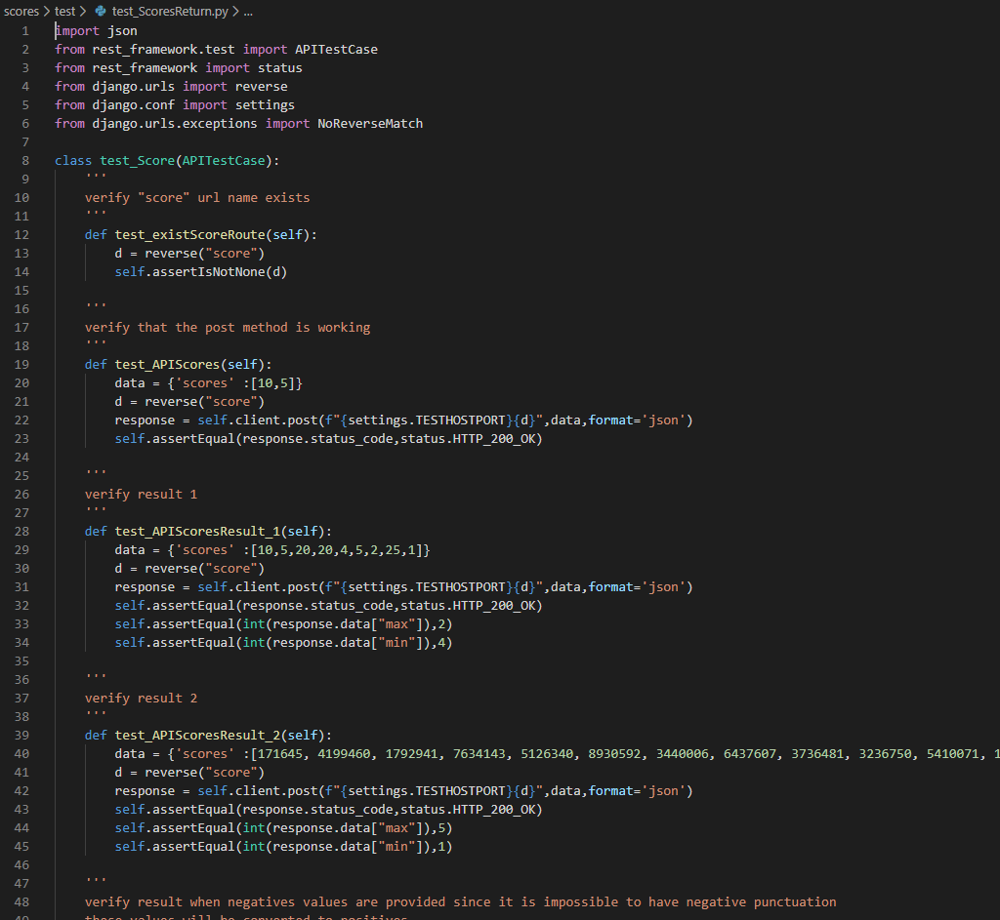

# Score API


This is an example of the "score" exercise : https://www.hackerrank.com/challenges/breaking-best-and-worst-records/problem

The service is exposed it through an API, also all the required unit test are provided

The API takes into consideration the following validation:

* Convert to positive every negative number
* Validate the correct input data
* Verify the existence of the endpoint
* Verify the correctness of the response data
* Validate the error messages

# Installation

## Via Docker

a DockerFile and DockerCompose files are provided just run:

- docker-compose up

The docker-compose file first run the test cases and after run the application exposing it in the port 8000


# Directly

install python 3

located inside the app folder run

* pip install -r requirements.txt

## Execute test cases

located inside the scores folder run
* python manage.py test


The test file is located at scores/test/test_ScoresReturn.py



## Run application

located inside the scores folder execute the command

* python manage.py runserver 0.0.0.0:8000 --noreload

This will execute the application in localhost in the port 8000


The code of the API is located at scores/API/views_score.py


See the following code for test and use the application


```python
import requests
import os

headers = {}
headers['content-type'] = 'application/json'
args = {}
args['verify'] = False
os.environ['no_proxy'] = '127.0.0.1,localhost'
data = {'scores' :[10,5,20,20,4,5,2,25,1]}
r = requests.post('http://localhost:8000/api/scores',json=data,headers=headers,**args)
print(r)
print(r.text)
```

    <Response [200]>
    {"max":"2","min":"4"}
    
